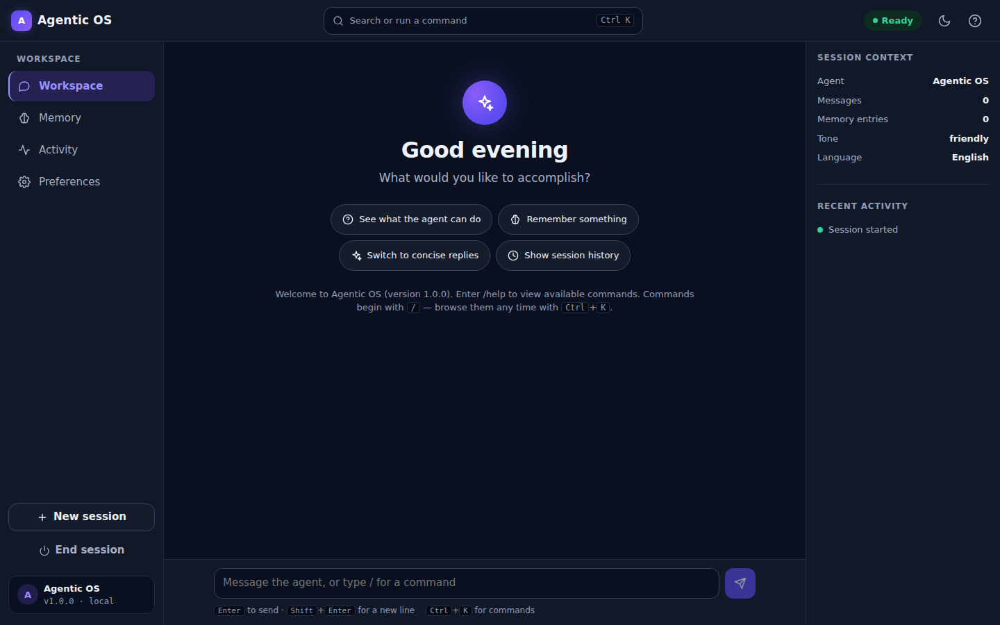

# Agentic OS

An interactive intelligent assistant with two front doors: a modern web
workspace and the original command-line interface. The agent understands
commands, applies your preferences, keeps conversation history, and
remembers information between sessions.

In this project, "operating system" means an intelligent assistant
environment — not a replacement for Windows, macOS, or Linux.



## Main Features

- **Web workspace** — a responsive React application with a greeting hero,
  conversation view, centered command search and palette (Ctrl/⌘+K),
  activity timeline with session health, onboarding, and a token-based
  design system with dark, light, and system themes
- **Command-line interface** — the original `python main.py` experience,
  fully preserved and dependency-free
- **One brain, two faces** — both interfaces drive the same tested Python
  `Agent` class; no logic is duplicated in the frontend
- **Session restore** — refreshing the browser reconnects to the same
  conversation (sessions expire when the server restarts; saved memory
  does not)
- **Persistent memory** in `data/memory.json` that survives restarts, with
  **categories and timestamps**, search, category filters, add, **in-place
  edit**, delete, and delete-all controls — destructive actions always
  require confirmation (old plain-text memory files load transparently)
- **Data controls** — export everything (memory, preferences, history,
  transcript) as JSON, clear history, or delete all memory from one place
- **Preferences** (tone, your name, language, history recording) applied to
  responses immediately, plus interface settings (theme, reduced motion)
- **Responsive by design** — sidebar navigation on desktop, a bottom tab
  bar on phones and tablets, verified from 320 px up
- **Production-quality states** — skeleton loading, empty, success, error,
  offline, and retry paths for every workflow, plus a filterable activity
  timeline (System / Memory / Preferences / Errors)
- **Continuous integration** — a GitHub Actions workflow runs the entire
  Python, unit, build, and end-to-end suite on every push
- **Accessibility** — WCAG 2.2 AA verified by automated axe scans plus
  keyboard review; full keyboard operation, focus-trapped dialogs,
  reduced-motion support (system setting and in-app switch)
- **Measured performance** — Lighthouse (mobile emulation, production
  build): Performance 96, Accessibility 100, Best Practices 100, SEO 100;
  LCP 2.3 s, CLS 0, TBT 0 ms

## Architecture

```
Browser (React + TypeScript + Vite SPA — frontend/)
   │  JSON over HTTP (typed contracts, timeouts, central error handling)
   ▼
FastAPI adapter (server/app.py) — sessions, validation, safe errors,
CORS, static hosting of the built frontend
   │  direct in-process calls
   ▼
Agent class (agent.py) + utils.py + config.json + data/memory.json
   ▲
   └── Command-line interface (main.py) uses the same Agent directly
```

The adapter contains no business logic: every web operation maps onto the
Agent's tested command surface (`/remember`, `/forget`, `/set`, `/clear`)
and returns fresh state snapshots.

## Directory Structure

```text
├── main.py                # CLI entry point
├── agent.py               # The Agent class (commands, memory, preferences)
├── utils.py               # Config loading, JSON persistence, validation
├── server/app.py          # FastAPI adapter + static hosting
├── config.json            # User-editable settings
├── data/memory.json       # Persistent memory (starts empty)
├── tests/                 # Python unittest suite (agent, utils, API)
├── frontend/
│   ├── src/
│   │   ├── app/           # Shell, store, theme
│   │   ├── features/      # chat, commands, memory, preferences,
│   │   │                  # activity, onboarding
│   │   ├── shared/        # api client, types, components, styles (tokens)
│   │   └── tests/         # Vitest unit tests
│   └── e2e/               # Playwright end-to-end + accessibility tests
├── docs/
│   ├── UI_UX_AUDIT.md     # Audit, plan, and acceptance criteria
│   └── screenshots/       # Final interface captures
├── README.md · user_guide.md · requirements.txt · .env.example
```

## System Requirements

- Python 3.10+ (CLI alone needs only the standard library)
- Node.js 20+ and npm (web interface only)
- No API keys, no external services, no credentials

## Installation

```bash
git clone <repository-url>
cd 11

# Web interface dependencies
pip install -r requirements.txt
cd frontend && npm install && npm run build && cd ..
```

## Running the Application

**Web interface (recommended):**

```bash
python -m uvicorn server.app:app --port 8000
```

Then open <http://localhost:8000>. The server hosts both the API and the
built frontend.

**Development mode** (hot reload, two terminals):

```bash
python -m uvicorn server.app:app --reload --port 8000   # terminal 1
cd frontend && npm run dev                              # terminal 2 → http://localhost:5173
```

**Command-line interface:**

```bash
python main.py
```

## Testing

```bash
# Python: agent, utils, and API tests (73 tests)
python -m unittest discover tests

# Frontend unit tests (18 tests)
cd frontend && npm test

# End-to-end + accessibility (17 checks across desktop and mobile;
# requires the production build: npm run build)
cd frontend && npx playwright test

# Type checking
cd frontend && npm run typecheck
```

The same suite runs automatically in CI (`.github/workflows/ci.yml`) on
every push. All 108 tests pass on the submitted version. In environments with a
pre-installed browser, point Playwright at it:
`PLAYWRIGHT_EXECUTABLE_PATH=/path/to/chromium npx playwright test`.

## Basic Usage Example (web)

1. Open the app — a short onboarding explains the basics.
2. Type `Hello there` and press Enter, or pick a suggested action.
3. Press <kbd>Ctrl</kbd>+<kbd>K</kbd>, choose `/remember`, and save a fact.
4. Open **Memory** to search, edit, delete, or export what's saved — the
   **Data controls** card also clears history or deletes all memory, always
   with a confirmation step.
5. Open **Preferences**, switch the tone to *Concise* (replies change
   immediately), and set your name for a personal greeting.
6. Check **Activity** for the event timeline and session health, and use
   **End session** in the sidebar to close gracefully.

The same commands work in the CLI:

```text
Welcome to Agentic OS (version 1.0.0). Enter /help to view available commands.
You: /set tone concise
Agent: Preference updated: tone = concise.
You: /remember My preferred language is English.
Agent: Information saved.
You: /history
Agent: /set tone concise
       /remember My preferred language is English.
```

See `user_guide.md` for the full command reference.

## Security and Privacy

- Memory is stored as plain text in `data/memory.json` on your own
  computer; nothing is sent to any external service. Remove entries from
  the Memory panel, with `/forget`, or by deleting the file.
- The repository contains no secrets; `.env.example` documents the few
  optional environment variables (all with safe defaults).
- The API validates input lengths and shapes, restricts CORS, hides stack
  traces, and requires confirmation in the UI before destructive actions.

## Known Limitations

- The agent recognizes commands and produces tone-styled acknowledgements
  for free text; it does not use an AI language model.
- Preference changes apply to the current session; permanent defaults are
  edited in `config.json`.
- Sessions survive a browser refresh but not a server restart; after a
  restart the app starts a fresh session (saved memory persists).
- The server is designed for local, single-user use — there is no
  authentication layer.

## Future Improvements

- Persist preference changes back to `config.json` on request
- Streamed responses and a pluggable AI-model backend
- Session restore across server restarts
- Named memory keys (e.g. `/remember birthday = 1 May`)

## Author and Course Information

- Author: Ahmad Zayan
- Course: Agentic OS Final Project
- Version: 1.0.0
